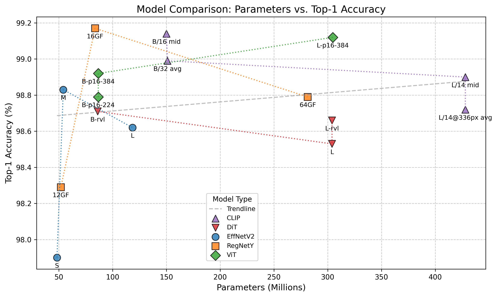
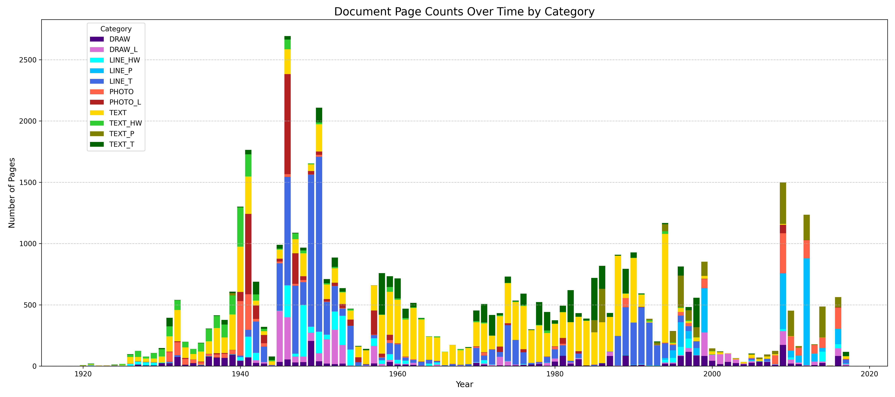

# Image classification using fine-tuned CLIP - for historical document sorting

### Goal: solve a task of archive page images sorting (for their further content-based processing)

**Scope:** Processing of images, training / evaluation of CLIP model,
input file/directory processing, class 🪧  (category) results of top
N predictions output, predictions summarizing into a tabular format, 
HF 😊 hub [^1] 🔗 support for the model, multiplatform (Win/Lin) data 
preparation scripts for PDF to PNG conversion

### Table of contents 📑

  * [Versions 🏁](#versions-)
  * [Model description 📇](#model-description-)
    + [Data 📜](#data-)
    + [Categories 🪧️](#categories-)
  * [How to install 🔧](#how-to-install-)
  * [How to run prediction 🪄 modes](#how-to-run-prediction--modes)
    + [Page processing 📄](#page-processing-)
    + [Directory processing 📁](#directory-processing-)
  * [Results 📊](#results-)
      - [Result tables and their columns 📏📋](#result-tables-and-their-columns-)
  * [Data preparation 📦](#data-preparation-)
    + [PDF to PNG 📚](#pdf-to-png-)
    + [PNG pages annotation 🔎](#png-pages-annotation-)
    + [PNG pages sorting for training 📬](#png-pages-sorting-for-training-)
  * [For developers 🪛](#for-developers-)
    * [Training 💪](#training-)
    * [Evaluation 🏆](#evaluation-)
  * [Contacts 📧](#contacts-)
  * [Acknowledgements 🙏](#acknowledgements-)
  * [Appendix 🤓](#appendix-)

----

## Versions 🏁

There are currently 4 version of the model available for download, both of them have the same set of categories, 
but different data annotations. The latest `v1.1.3` is considered to be default and can be found in the `main` branch
of HF 😊 hub [^1] 🔗 

|  Version | Base code      | Pages |   PDFs    | Description                   |
|---------:|----------------|:-----:|:---------:|:------------------------------|
|   `v1.1` | `ViT-B/16`     | 14270 | **5730**  | smallest (old default)        |
|   `v1.2` | `ViT-B/32`     | 14270 | **5730**  | small with higher granularity |
|   `v2.1` | `ViT-L/14`     | 14270 | **5730**  | large                         |
|   `v2.2` | `ViT-L/14@336` | 14270 | **5730**  | large with highest resolution |
| `v1.1.3` | `ViT-B/16`     | 38625 | **37328** | smallest and most accurate    |
| `v1.2.3` | `ViT-B/32`     | 38625 | **37328** | small and 2nd in accuracy     |
| `v2.1.3` | `ViT-B/14`     | 38625 | **37328** | larges and not too accurate   |
| `v2.2.3` | `ViT-B/14@336` | 38625 | **37328** | larges and not too accurate   |

Base model - size 👀

| **Version**                         | **Disk space** | **Parameters (Millions)** |
|-------------------------------------|----------------|---------------------------|
| `openai/clip-vit-base-patch16`      | 992 Mb         | 149.62 M                  |
| `openai/clip-vit-base-patch32`      | 1008 Mb        | 151.28 M                  |
| `openai/clip-vit-large-patch14`     | 1.5 Gb         | 427.62 M                  |
| `openai/clip-vit-large-patch14-336` | 1.5 Gb         | 427.94 M                  |

## Model description 📇

🔲 **Fine-tuned** model repository: UFAL's **clip-historical-page** [^1] 🔗

🔳 **Base** model repository: OpenAI's **clip-vit-base-patch16**,  **clip-vit-base-patch32**,  **clip-vit-large-patch14**, **clip-vit-large-patch14-336** [^2] [^13] [^14] [^15] 🔗

The model was trained on the manually ✍️ annotated dataset of historical documents, in particular, images of pages 
from the archival documents with paper sources that were scanned into digital form. 

The images contain various combinations of texts ️📄, tables 📏, drawings 📈, and photos 🌄 - 
categories 🪧 described [below](#categories-) were formed based on those archival documents. Page examples can be found in
the [category_samples](category_samples) 📁 directory.

The key **use case** of the provided model and data processing pipeline is to classify an input PNG image from PDF scanned 
paper source into one of the categories - each responsible for the following content-specific data processing pipeline.

> In other words, when several APIs for different OCR subtasks are at your disposal - run this classifier first to 
> mark the input data as machine-typed (old style fonts) / handwritten ✏️ / just printed plain ️📄 text 
> or structured in tabular 📏 format text, as well as to mark the presence of the printed 🌄 or drawn 📈 graphic 
> materials yet to be extracted from the page images.

The figure above shows accuracy and parameters comparison of different base models tested on the same data, demonstrating
best models overall (above the trendline) which mainly includes image-based models like CNNs and transformers, and the hybrid
CLIP models themselves (best versions of each base model).

Versions of CLIP models are grounded on the textual category description sets, all illustrated in 
[descriptions_comparison_graph.png](result%2Fstats%2Fmodel_accuracy_plot.png) 📎 which is a graph containing separate and averaged results 
of all category 🪧 descriptions. 

As our experiments showed, the averaging strategy is not the best. Moreover, the smallest model
ViT-B/16 showed the best results after fine-tuning model on some selected category 🪧 set.

Check out all of the prepared category 🪧 descriptions in the [category_descriptions](category_descriptions) 📁 folder.
Which supports versions mapping from 1 to 9 for the csv files starting with `page_categories_` prefix. The separate set
starting with `TOTAL` is a mixture of all category descriptions, a set starting with `GENERAL` is a simplified category 🪧 set 
(only 4 classes), and a set starting with `EXPANDED` is an experimental more fine-grained in categories version of the category 🪧 descriptions.

### Data 📜

The dataset is provided under Public Domain license, and consists of **48,499** PNG images of pages from **37,328** archival documents.
The source image files and their annotation can be found in the LINDAT repository [^16] 🔗. 

The annotation provided includes 5 different
dataset splits of `vX.X.3` model versions, and it's recommended to average all 5 trained model weights to get a more robust
model for prediction (in some cases, like `TEXT` and `TEXT_T` categories which samples very often look the same, the accuracy of those 
problematic categories could drop below 90% with off-diagonal errors rising above 10% after the averaging of trained models). Anyhow, the
averaged model usually score higher accuracy than any of its individual components... or sometimes causes a drop in accuracy for 
the most ambiguous categories 🪧️ - depends mostly on the base model choice.

Our dataset is not split using a simple random shuffle. This is because the data contains structured and clustered 
distributions of page types within many categories. A random shuffle would likely result in subsets with poor 
representative variability.

Instead, we use a deterministic, periodic sampling method with a randomized offset. To maximize the size of the 
training 💪 set, we select the development and test 🏆 subsets first. The training subset then consists of all remaining pages.

Here's the per-category 🪧 procedure for selecting the development and test 🏆 sets:

1. For the category of size `N` compute  the desired subset size, `k`, as a fixed proportion (`test_ratio` which was 10%) of `N`
2. Compute a selection step, `S`, as `S ≈ N/k` which serves a period base for the selection
3. Apply a random shift to `S` - an integer index in the range `[S_i - S/4; S_i + S/4]` for every `i`-th of `k` steps of `S`.
4. Select every `S`-th (`S`-thish in fact) element from the alphabetically ordered sequence after applying the random shift.
5. Finally, Limit selected indices to be within the range of the category size `N`.

This method produces subsets that:

- Respect the original ordering and local clustering in the data
- Preserve the proportional representation of each category
- Introduce controlled randomness, so the selected samples are not strictly periodic

This ensures that our subsets cover the full chronological and structural variability of the 
collection, leading to a more robust and reliable model evaluation. 

**Training** 💪 set of the model: **14270** images for `vX.X` 

**Training** 💪 set of the model: **38625** images for `vX.X.3` 

The training subsets above are followed by the test sets below:

**Evaluation** 🏆 set:  **1290** images for `vX.X` models

**Evaluation** 🏆 set:  **4823** images (for `vX.X.3` models)

Manual ✍️ annotation was performed beforehand and took some time ⌛, the categories 🪧 tabulated  [below](#categories-) were formed from
different sources of the archival documents originated in the 1920-2020 years span. 

| Category        | Dataset 0   | Dataset 1    | Dataset 2    | Dataset 3     |
|-----------------|-------------|--------------|--------------|---------------|
| DRAW            | 1090 (9.1%) | 1368 (8.8%)  | 1472 (9.3%)  | 2709 (5.6%)   |
| DRAW_L          | 1091 (9.1%) | 1383 (8.9%)  | 1402 (8.8%)  | 2921 (6.0%)   |
| LINE_HW         | 1055 (8.8%) | 1113 (7.2%)  | 1115 (7.0%)  | 2514 (5.2%)   |
| LINE_P          | 1092 (9.1%) | 1540 (9.9%)  | 1580 (10.0%) | 2439 (5.0%)   |
| LINE_T          | 1098 (9.2%) | 1664 (10.7%) | 1668 (10.5%) | 9883 (20.4%)  |
| PHOTO           | 1081 (9.1%) | 1632 (10.5%) | 1730 (10.9%) | 2691 (5.5%)   |
| PHOTO_L         | 1087 (9.1%) | 1087 (7.0%)  | 1088 (6.9%)  | 2830 (5.8%)   |
| TEXT            | 1091 (9.1%) | 1587 (10.3%) | 1592 (10.0%) | 14227 (29.3%) |
| TEXT_HW         | 1091 (9.1%) | 1092 (7.1%)  | 1092 (6.9%)  | 2008 (4.1%)   |
| TEXT_P          | 1083 (9.1%) | 1540 (9.9%)  | 1633 (10.3%) | 2312 (4.8%)   |
| TEXT_T          | 1081 (9.1%) | 1476 (9.5%)  | 1482 (9.3%)  | 3965 (8.2%)   |
| **Unique PDFs** | 5001        | 5694         | 5729         | 37328         |
| **Total Pages** | 11,940      | 15,482       | 15,854       | 48,499        |

The table above shows category distribution for different model versions, where the last column
(`Dataset 3`) corresponds to the latest `vX.X.3` models data, which actually used 14,000 pages of
`TEXT` category, while other columns cover all the used samples - specifically 80% as training 💪, 
and 10% each as development and test 🏆 sets. The early model version used 90% of the data as training 💪
and the remaining 10% as both development and test 🏆 set due to the lack of annotated (manually 
classified) pages.

> [!NOTE]
> Disproportion of the categories 🪧 in both training data and provided evaluation [category_samples](category_samples) 📁 is
> **NOT** intentional, but rather a result of the source data nature. 

The specific content and language of the
source data is irrelevant considering the model's vision resolution, however, all of the data samples were from **archaeological 
reports** which may somehow affect the drawing detection preferences due to the common form of objects being ceramic pieces, 
arrowheads, and rocks formerly drawn by hand and later illustrated with digital tools (examples can be found in
[category_samples/DRAW](category_samples%2FDRAW) 📁)

### Categories 🪧

|    Label️ | Description                                                                                                      |
|----------:|:-----------------------------------------------------------------------------------------------------------------|
|    `DRAW` | **📈 - drawings, maps, paintings, schematics, or graphics, potentially containing some text labels or captions** |
|  `DRAW_L` | **📈📏 - drawings, etc but presented within a table-like layout or includes a legend formatted as a table**      |
| `LINE_HW` | **✏️📏 - handwritten text organized in a tabular or form-like structure**                                        |
|  `LINE_P` | **📏 - printed text organized in a tabular or form-like structure**                                              |
|  `LINE_T` | **📏 - machine-typed text organized in a tabular or form-like structure**                                        |
|   `PHOTO` | **🌄 - photographs or photographic cutouts, potentially with text captions**                                     |
| `PHOTO_L` | **🌄📏 - photos presented within a table-like layout or accompanied by tabular annotations**                     |
|    `TEXT` | **📰 - mixtures of printed, handwritten, and/or typed text, potentially with minor graphical elements**          |
| `TEXT_HW` | **✏️📄 - only handwritten text in paragraph or block form (non-tabular)**                                        |
|  `TEXT_P` | **📄 - only printed text in paragraph or block form (non-tabular)**                                              |
|  `TEXT_T` | **📄 - only machine-typed text in paragraph or block form (non-tabular)**                                        |

The categories were chosen to sort the pages by the following criteria: 

- **presence of graphical elements** (drawings 📈 OR photos 🌄)
- **type of text** 📄 (handwritten ✏️️ OR printed OR typed OR mixed 📰)
- **presence of tabular layout / forms** 📏

> The reasons for such distinction are different processing pipelines for different types of pages, which would be
> applied after the classification as mentioned [above](#model-description-).

Examples of pages sorted by category 🪧 can be found in the [category_samples](category_samples) 📁 directory
which is also available as a testing subset of the training data.

----

## How to install 🔧

Step-by-step instructions on this program installation are provided here. The easiest way to obtain the model would 
be to use the HF 😊 hub repository [^1] 🔗 that can be easily accessed via this project. 

Hardware requirements 👀

**Minimal** machine 🖥️ requirements for slow prediction run (and very slow training / evaluation):
- **CPU** with a decent (above average) operational memory size

**Ideal** machine 🖥️ requirements for fast prediction (and relatively fast training / evaluation):
- **CPU** of some kind and memory size
- **GPU** (for real CUDA [^10] support - only one of Nvidia's cards)

> [!WARNING]
> Make sure you have **Python version 3.10+** installed on your machine 💻 and check its
> **hardware requirements** for correct program running provided above. 
> Then create a separate virtual environment for this project 

How to 👀

Clone this project to your local machine 🖥️️ via:

    cd /local/folder/for/this/project
    git init
    git clone https://github.com/ufal/atrium-page-classification.git

Then change to the Vit and EffNet models or CLIP models branch (`master`, `clip` or `vit`):

    cd atrium-page-classification
    git checkout vit

**OR** for updating the already cloned project with some changes, go to the folder containing (hidden) `.git` 
subdirectory and run pulling which will merge upcoming files with your local changes:

    cd /local/folder/for/this/project/atrium-page-classification
    git add <changed_file>
    git commit -m 'local changes'

And then for updating the project with the latest changes from the remote repository, run:

    git pull -X theirs

Alternatively, if you are interested in a specific branch (`master`, `clip` or `vit`), you can update  it via:

    git fetch origin
    git checkout vit        
    git pull --ff-only origin vit

Alternatively, if you do **NOT** care about local changes **OR** you want to get the latest project files, 
just remove those files (all `.py`, `.txt` and `README` files) and pull the latest version from the repository:

    cd /local/folder/for/this/project/atrium-page-classification

And then for a total clean up and update, run:

    rm *.py
    rm *.txt
    rm README*
    git pull

Alternatively, for a specific branch (`master`, `clip` or `vit`):

    git reset --hard HEAD
    git clean -fd
    git fetch origin
    git checkout vit
    git pull origin vit

Overall, a force update to the remote repository branch (`master`, `clip` or `vit`) looks like this:

    git fetch origin
    git checkout vit
    git reset --hard origin/vit

Next step would be a creation of the virtual environment. Follow the **Unix** / **Windows**-specific 
instruction at the venv docs [^3] 👀🔗 if you don't know how to.

After creating the venv folder, activate the environment via:

    source <your_venv_dir>/bin/activate

and then inside your virtual environment, you should install Python libraries (takes time ⌛) 

> [!CAUTION]
> Up to **1 GB of space for model** files and checkpoints is needed, and up to **7 GB 
> of space for the Python libraries** (Pytorch and its dependencies, etc)

Installation of Python dependencies can be done via:

    pip install -r requirements.txt

> [!NOTE]
> The so-called **CUDA [^10] support** for Python's PyTorch library is supposed to be automatically installed
> at this point - when the presence of the GPU on your machine 🖥️
> is checked for the first time, later it's also checked every time before the model initialization
> (for training, evaluation or prediction run).

After the dependencies installation is finished successfully, in the same virtual environment, you can
run the Python program.  

To test that everything works okay and see the flag 
descriptions call for `--help` ❓:

    python3 run.py -h

You should see a (hopefully) helpful message about all available command line flags. Your next step would be
to **pull the model from the HF 😊 hub repository [^1] 🔗** via:

    python3 run.py --hf

**OR** for specific model version (e.g. `main`, `vX.1`, `vX.2` and `vX.X.3`) use the `--revision` flag:
 
    python3 run.py --hf -rev v1.1

**OR** for specific base model version (e.g. `ViT-B/16`, `ViT-B/32`, `ViT-L/14` or `ViT-L/14@336px`) use the `--model` 
or `-m` flag (only when the trained model version demands such base model as described [above](#versions-)):
 
    python3 run.py --hf -rev v2.2.3 -m `ViT-L/14@336px`

> [!IMPORTANT]
> If you already have the model files in the `models/<base_code>_rev_<revision>`
> directory (e.g., `models/ViT-B-16_rev_v1.1.3`), you do **NOT** have to use the `--hf` flag to download the
> model files from the HF 😊 repo [^1] 🔗 (only for the **model version update**).

You should see a message about loading the model from the hub and then saving it locally on
your machine 🖥️. 

Only after you have obtained the trained model files (takes less time ⌛ than installing dependencies), 
you can play with any commands provided [below](#how-to-run-prediction--modes).

After the model is downloaded, you should see a similar file structure: 

Initial project tree 🌳 files structure 👀

    
    /local/folder/for/this/project/atrium-page-classification
    ├── models
        └── <base_code>_rev_<revision> 
            ├── config.json
            ├── model.safetensors
            └── preprocessor_config.json
    ├── model_checkpoints
        ├── model_<categ_limit>_<base_code>_<lr>_<epoch>e.pt
        ├── model_<categ_limit>_<base_code>_<lr>_<epoch>e_cp.pt
        └── ...
    ├── data_scripts
        ├── windows
            ├── move_single.bat
            ├── pdf2png.bat
            └── sort.bat
        └── unix
            ├── move_single.sh
            ├── pdf2png.sh
            └── sort.sh
    ├── result
        ├── plots
            ├── date-time_<#samples>_EVAL_TOP-<top_N>_<base>_<revision>.png
            └── ...
        └── tables
            ├── date-time_<#samples>_EVAL_TOP-<top_N>_<base>_<revision>.csv
            ├── date-time_<#samples>_result_modelL_<base>_<revision>_TOP-<top_N>.csv
            ├── date-time_<#samples>_EVAL_<base>_<revision>_RAW.csv
            └── ...
        └── stats
            ├── model_accuracies.csv
            ├── model_accuracies_zero.csv
            ├── model_accuracies_plot.png
            ├── model_accuracies_zero_plot.png
            ├── date-time_model_<rev>_<max_categ>c_<seed>r_DATASETS.txt
            └── ...
    ├── category_samples
        ├── DRAW
            ├── CTX193200994-24.png
            └── ...
        ├── DRAW_L
        └── ...
    ├── category_descriptions
        ├── page_categories_init.csv
        ├── TOTAL_page_categories.csv
        └── ...
    ├── run.py
    ├── classifier.py
    ├── minor_classes.py
    ├── utils.py
    ├── requirements.txt
    ├── config.txt
    ├── README.md
    └── ...

Some of the folders may be missing, like mentioned [later](#for-developers-) `model_output` which is automatically created
only after launching the model.

----

## How to run prediction 🪄 modes

There are two main ways to run the program:

- **Single PNG file classification** 📄
- **Directory with PNG files classification** 📁

To begin with, open [config.txt](config.txt) ⚙ and change folder path in the `[INPUT]` section, then 
optionally change `top_N` and `batch` in the `[SETUP]` section.

> [!NOTE]
>️ **Top-3** is enough to cover most of the images, setting **Top-5** will help with a small number 
> of difficult to classify samples.

The `batch` variable value depends on your machine 🖥️ memory size

Rough estimations of memory usage per batch size 👀

| **Batch size** | **CPU / GPU memory usage** |
|----------------|----------------------------|
| 4              | 2 Gb                       |
| 8              | 3 Gb                       |
| 16             | 5 Gb                       |
| 32             | 9 Gb                       |
| 64             | 17 Gb                      |

It is safe to use batch size below **12** for a regular office desktop computer, and lower it to **4** if it's an old device.
For training on a High Performance Computing cluster, you may use values above **20** for
the `batch` variable in the `[SETUP]` section.

> [!CAUTION]
> Do **NOT** try to change **base_model** and other section contents unless you know what you are doing

Rough estimations of disk space needed for trained model in relation to the base model 👀

| **Version**                         | **Disk space** | **Parameters (Millions)** |
|-------------------------------------|----------------|---------------------------|
| `openai/clip-vit-base-patch16`      | 992 Mb         | 149.62 M                  |
| `openai/clip-vit-base-patch32`      | 1008 Mb        | 151.28 M                  |
| `openai/clip-vit-large-patch14`     | 1.5 Gb         | 427.62 M                  |
| `openai/clip-vit-large-patch14-336` | 1.5 Gb         | 427.94 M                  |

Make sure the virtual environment with all the installed libraries is activated, you are in the project 
directory with Python files and only then proceed. 

How to 👀

    cd /local/folder/for/this/project/
    source <your_venv_dir>/bin/activate
    cd atrium-page-classification

> [!IMPORTANT]
> All the listed below commands for Python scripts running are adapted for **Unix** consoles, while
> **Windows** users must use `python` instead of `python3` syntax

### Page processing 📄

The following prediction should be run using the `-f` or `--file` flag with the path argument. Optionally, 
you can use the `-tn` or `--topn` flag with the number of guesses you want to get, and also the `-m` or 
`--model` flag with the path to the model folder argument. 

How to 👀

Run the program from its starting point [run.py](run.py) 📎 with optional flags:

    python3 run.py -tn 3 -f '/full/path/to/file.png' --model_path '/full/path/to/model/folder' -m '<base_code>'

for exactly TOP-3 guesses with a console output.

**OR** if you are sure about default variables set in the [config.txt](config.txt) ⚙:

    python3 run.py -f '/full/path/to/file.png'

to run a single PNG file classification - the output will be in the console. 

> [!NOTE]
> Console output and all result tables contain **normalized** scores for the highest N class 🪧  scores

### Directory processing 📁

The following prediction type does **NOT** require explicit directory path setting with the `-d` or `--directory`, 
since its default value is set in the [config.txt](config.txt) ⚙ file and awakens when the `--dir` flag 
is used. The same flags for the number of guesses and the model folder path as for the single-page 
processing can be used. In addition, a directory-specific flag `--raw` is available. 

> [!CAUTION]
> You must either explicitly set the `-d` flag's argument or use the `--dir` flag (calling for the preset in 
> `[INPUT]` section default value of the input directory) to process PNG files on the directory
> level, otherwise, nothing will happen

Worth mentioning that the **directory 📁 level processing is performed in batches**, therefore you should refer to
the hardware's memory capacity requirements for different batch sizes tabulated [above](#how-to-run-prediction--modes).

How to 👀

    python3 run.py -tn 3 -d '/full/path/to/directory' --model_path '/full/path/to/model/folder' -m '<base_code>'

for exactly TOP-3 guesses in tabular format from all images found in the given directory.

**OR** if you are really sure about default variables set in the [config.txt](config.txt) ⚙:

    python3 run.py --dir 
    
    python3 run.py -rev v1.2 -m ViT-B/32 --dir

The classification results of PNG pages collected from the directory will be saved 💾 to related [results](result) 📁
folders defined in `[OUTPUT]` section of [config.txt](config.txt) ⚙ file.

> [!TIP]
> To additionally get raw class 🪧 probabilities from the model along with the TOP-N results, use
> `--raw` flag when processing the directory (**NOT** available for single file processing)

Naturally, processing of the large amount of PNG pages takes time ⌛ and progress of this process
is recorded in the console via messages like `Processed <B×N> images` where `B`
is batch size set in the `[SETUP]` section of the [config.txt](config.txt) ⚙ file, 
and `N` is an iteration of the current dataloader processing loop. 

Only after all images from the input directory are processed, the output table is
saved 💾 in the `result/tables` folder. 

----

## Results 📊

There are accuracy performance measurements and plots of confusion matrices for the evaluation 
dataset (10% of the provided in `[TRAIN]`'s folder data). Both graphic plots and tables with 
results can be found in the [result](result) 📁 folder.

| Version      | Base Model + category set | Accuracy (%) | Comment       |
|:-------------|:--------------------------|-------------:|---------------|
| **v1.1.3.1** | **ViT-B/16 init**         |     **99.1** | Very good     |
| v1.1.3.2     | ViT-B/16 details          |        99.08 |               |
| **v1.1.3.3** | **ViT-B/16 extra**        |    **99.12** | 2nd Best      |
| **v1.1.3.4** | **ViT-B/16 gemini**       |     **99.1** | Very good     |
| v1.1.3.5     | ViT-B/16 gpt              |        98.95 |               |
| **v1.1.3.6** | **ViT-B/16 large**        |     **99.1** | Very good     |
| **v1.1.3.7** | **ViT-B/16 mid**          |    **99.14** | Best          |
| v1.1.3.8     | ViT-B/16 min              |        98.86 |               |
| v1.1.3.9     | ViT-B/16 short            |        99.06 |               |
| v1.1.3       | ViT-B/16 average          |        99.06 |               |
| v1.2.3.1     | ViT-B/32 init             |        98.95 |               |
| v1.2.3.3     | ViT-B/32 extra            |        98.92 |               |
| v1.2.3.4     | ViT-B/32 gemini           |        98.94 |               |
| v1.2.3.6     | ViT-B/32 large            |        98.97 |               |
| v1.2.3.7     | ViT-B/32 mid              |        98.86 |               |
| **v1.2.3**   | **ViT-B/32 average**      |    **98.99** | Larger & good |
| **v2.2.3.1** | **ViT-L/14-336px init**   |    **98.86** | Large & OK    |
| v2.2.3.3     | ViT-L/14-336px extra      |        98.59 |               |
| v2.2.3.4     | ViT-L/14-336px gemini     |        98.97 |               |
| v2.2.3.6     | ViT-L/14-336px large      |        98.68 |               |
| v2.2.3.7     | ViT-L/14-336px mid        |        98.81 |               |
| v2.2.3       | ViT-L/14-336px average    |        98.72 |               |
| v2.1.3.1     | ViT-L/14 init             |        98.97 |               |
| v2.1.3.3     | ViT-L/14 extra            |        98.83 |               |
| **v2.1.3.4** | **ViT-L/14 gemini**       |    **98.86** | Large & OK    |
| v2.1.3.6     | ViT-L/14 large            |        98.92 |               |
| v2.1.3.7     | ViT-L/14 mid              |         98.9 |               |
| v2.1.3       | ViT-L/14 average          |        98.81 |               |

`v1.1.3.1` Evaluation set's accuracy (**Top-1**):  **99.1%** 🏆

Confusion matrix 📊 TOP-1 👀

`v1.1.3.3` Evaluation set's accuracy (**Top-1**):  **99.12%** 🏆

Confusion matrix 📊 TOP-1 👀

`v1.1.3.4` Evaluation set's accuracy (**Top-1**):  **99.1%** 🏆

Confusion matrix 📊 TOP-1 👀

`v1.1.3.6` Evaluation set's accuracy (**Top-1**):  **99.1%** 🏆

Confusion matrix 📊 TOP-1 👀

`v1.1.3.7` Evaluation set's accuracy (**Top-1**):  **99.14%** 🏆

Confusion matrix 📊 TOP-1 👀

`v1.2.3` Evaluation set's accuracy (**Top-1**):  **98.99%** 🏆

Confusion matrix 📊 TOP-1 👀

`v2.1.3.1` Evaluation set's accuracy (**Top-1**):  **98.97%** 🏆

Confusion matrix 📊 TOP-1 👀

`v2.2.3.4` Evaluation set's accuracy (**Top-1**):  **98.97%** 🏆

Confusion matrix 📊 TOP-1 👀

> **Confusion matrices** provided above show the diagonal of matching gold and predicted categories 🪧
> while their off-diagonal elements show inter-class errors. By those graphs you can judge 
> **what type of mistakes to expect** from your model. 

By running tests on the evaluation dataset after training you can generate the following output files:

- **EVAL_table_Nn_Cc_<base>_date-time.csv** - (by default) results of the evaluation dataset with TOP-N guesses
- **conf_mat_Nn_Cc_<base>_date-time.png** - (by default) confusion matrix plot for the evaluation dataset also with TOP-N guesses
- **date-time_<base>_RAW.csv** - (by flag `--raw`) raw probabilities for all classes of the processed directory 
- **result_date-time_<base>_Nn_Cc.csv** - (by default) results of the processed directory with TOP-N guesses

> [!NOTE]
> Generated tables will be sorted by **FILE** and **PAGE** number columns in ascending order. 

Additionally, results of prediction inference run on the directory level without checked results are included.

### Result tables and their columns 📏📋

General result tables 👀

Demo files  `v1.1.3.1`:

- Manually ✍️ **checked** evaluation dataset (TOP-1): [model_TOP-1_EVAL.csv](result%2Ftables%2F20251022-0335_5449_EVAL_TOP-1_ViT-B16_v1131.csv) 📎

- Manually ✍️ **checked** evaluation dataset (TOP-3): [model_TOP-53EVAL.csv](result%2Ftables%2F20251022-0059_5449_EVAL_TOP-3_ViT-B16_v1131.csv) 📎
- 
- **Unchecked with TRUE** values (small): [model_TOP-1.csv](result%2Ftables%2F20251023-1412_114_result_ViT-B16_v1.1.3.1_TOP-1.csv)📎

Demo files  `v1.1.3.3`:

- Manually ✍️ **checked** evaluation dataset (TOP-1): [model_TOP-1_EVAL.csv](result%2Ftables%2F20251022-1435_5449_EVAL_TOP-1_ViT-B16_v1133.csv) 📎

- Manually ✍️ **checked** evaluation dataset (TOP-3): [model_TOP-53EVAL.csv](result%2Ftables%2F20251022-1436_5449_EVAL_TOP-3_ViT-B16_v1133.csv) 📎

- **Unchecked with TRUE** values (small): [model_TOP-1.csv](result%2Ftables%2F20251022-1223_114_result_ViT-B16_v1.1.3.3_TOP-1.csv)📎

Demo files  `v1.1.3.4`:

- Manually ✍️ **checked** evaluation dataset (TOP-1): [model_TOP-1_EVAL.csv](result%2Ftables%2F20251022-0411_5449_EVAL_TOP-1_ViT-B16_v1134.csv) 📎

- Manually ✍️ **checked** evaluation dataset (TOP-3): [model_TOP-53EVAL.csv](result%2Ftables%2F20251022-0140_5449_EVAL_TOP-3_ViT-B16_v1134.csv) 📎

- **Unchecked with TRUE** values (small): [model_TOP-1.csv](result%2Ftables%2F20251023-1413_114_result_ViT-B16_v1.1.3.4_TOP-1.csv)📎

Demo files  `v1.1.3.6`:

- Manually ✍️ **checked** evaluation dataset (TOP-1): [model_TOP-1_EVAL.csv](result%2Ftables%2F20251022-0435_5449_EVAL_TOP-1_ViT-B16_v1136.csv) 📎

- Manually ✍️ **checked** evaluation dataset (TOP-3): [model_TOP-53EVAL.csv](result%2Ftables%2F20251022-0207_5449_EVAL_TOP-3_ViT-B16_v1136.csv) 📎

- **Unchecked with TRUE** values (small): [model_TOP-1.csv](result%2Ftables%2F20251023-1413_114_result_ViT-B16_v1.1.3.6_TOP-1.csv)📎

Demo files  `v1.1.3.7`:

- Manually ✍️ **checked** evaluation dataset (TOP-1): [model_TOP-1_EVAL.csv](result%2Ftables%2F20251022-1656_5449_EVAL_TOP-1_ViT-B16_v1137.csv) 📎

- Manually ✍️ **checked** evaluation dataset (TOP-3): [model_TOP-53EVAL.csv](result%2Ftables%2F20251022-1524_5449_EVAL_TOP-3_ViT-B16_v1137.csv) 📎

- **Unchecked with TRUE** values (small): [model_TOP-1.csv](result%2Ftables%2F20251022-1224_114_result_ViT-B16_v1.1.3.7_TOP-1.csv)📎

Demo files  `v1.2.3`:

- Manually ✍️ **checked** evaluation dataset (TOP-1): [model_TOP-1_EVAL.csv](result%2Ftables%2F20251022-1718_5449_EVAL_TOP-1_ViT-B32_v123.csv) 📎

- Manually ✍️ **checked** evaluation dataset (TOP-3): [model_TOP-53EVAL.csv](result%2Ftables%2F20251022-1537_5449_EVAL_TOP-3_ViT-B32_v123.csv) 📎

- **Unchecked with TRUE** values (small): [model_TOP-1.csv](result%2Ftables%2F20251022-1226_114_result_ViT-B32_v1.2.3_TOP-1.csv)📎

Demo files  `v2.1.3.1`:

- Manually ✍️ **checked** evaluation dataset (TOP-1): [model_TOP-1_EVAL.csv](result%2Ftables%2F20251022-1733_5449_EVAL_TOP-1_ViT-L14_v2131.csv) 📎
- 
- Manually ✍️ **checked** evaluation dataset (TOP-3): [model_TOP-53EVAL.csv](result%2Ftables%2F20251022-1551_5449_EVAL_TOP-3_ViT-L14_v2131.csv) 📎

- **Unchecked with TRUE** values (small): [model_TOP-1.csv](result%2Ftables%2F20251022-1226_114_result_ViT-L14_v2.1.3.1_TOP-1.csv)📎

Demo files  `v2.2.3.4`:

- Manually ✍️ **checked** evaluation dataset (TOP-1): [model_TOP-1_EVAL.csv](result%2Ftables%2F20251022-1457_5449_EVAL_TOP-1_ViT-L14-336px_v2234.csv) 📎

- Manually ✍️ **checked** evaluation dataset (TOP-3): [model_TOP-53EVAL.csv](result%2Ftables%2F20251022-1452_5449_EVAL_TOP-3_ViT-L14-336px_v2234.csv) 📎

- **Unchecked with TRUE** values (small): [model_TOP-1.csv](result%2Ftables%2F20251022-1230_114_result_ViT-L14-336px_v2.2.3.4_TOP-1.csv)📎

Plus the small  **Unchecked with TRUE** values combination of the best 5 models: [models_TOP-1.csv](result%2Ftables%2F20251023-1412_BEST_5_models_TOP-1.csv)📎

With the following **columns** 📋:

- **FILE** - name of the file
- **PAGE** - number of the page
- **CLASS-N** - label of the category 🪧, guess TOP-N 
- **SCORE-N** - score of the category 🪧, guess TOP-N

and optionally
 
- **TRUE** - actual label of the category 🪧 

Raw result tables 👀

Demo files `v1.1`:

- **Unchecked with TRUE** values (small) **RAW**: [model_RAW.csv](result%2Ftables%2F20250701-1816_ViT-B16_RAW.csv) 📎

Demo files `v1.2`:

- **Unchecked with TRUE** values (small) **RAW**: [model_RAW.csv](result%2Ftables%2F20250701-2216_ViT-B32_RAW.csv) 📎

Demo files `v2.1`:

- **Unchecked with TRUE** values (small) **RAW**: [model_RAW.csv](result%2Ftables%2F20250701-1743_ViT-L14_RAW.csv) 📎

Demo files `v2.2`:

- **Unchecked with TRUE** values (small) **RAW**: [model_RAW.csv](result%2Ftables%2F20250701-2218_ViT-L14@336px_RAW.csv) 📎

With the following **columns** 📋:

- **FILE** - name of the file
- **PAGE** - number of the page
- **<CATEGORY_LABEL>** - separate columns for each of the defined classes 🪧 

The reason to use the `--raw` flag is the possible convenience of results review, 
since the rows will be basically sorted by categories, and most ambiguous ones will
have more small probabilities instead of zeros than the most obvious (for the model) 
categories 🪧.

----

## Data preparation 📦

You can use this section as a guide for creating your own dataset of pages, which will be suitable for
further model processing.

There are useful multiplatform scripts in the [data_scripts](data_scripts) 📁 folder for the whole process of data preparation. 

> [!NOTE]
> The `.sh` scripts are adapted for **Unix** OS and `.bat` scripts are adapted for **Windows** OS, yet 
> their functionality remains the same

On **Windows** you must also install the following software before converting PDF documents to PNG images:
- ImageMagick [^5] 🔗 - download and install the latest version
- Ghostscript [^6] 🔗 - download and install the latest version (32 or 64-bit) by AGPL

### PDF to PNG 📚

The source set of PDF documents must be converted to page-specific PNG images before processing. The following steps
describe the procedure of converting PDF documents to PNG images suitable for training, evaluation, or prediction inference.

Firstly, copy the PDF-to-PNG converter script to the directory with PDF documents.

How to 👀

 **Windows**:

    move \local\folder\for\this\project\data_scripts\pdf2png.bat \full\path\to\your\folder\with\pdf\files

**Unix**:

    cp /local/folder/for/this/project/data_scripts/pdf2png.sh /full/path/to/your/folder/with/pdf/files

Now check the content and comments in [pdf2png.sh](data_scripts%2Funix%2Fpdf2png.sh) 📎 or [pdf2png.bat](data_scripts%2Fwindows%2Fpdf2png.bat) 📎 
script, and run it. 

> [!IMPORTANT]
> You can optionally comment out the **removal of processed PDF files** from the script, yet it's **NOT** 
> recommended in case you are going to launch the program several times from the same location. 

How to 👀

**Windows**:

    cd \full\path\to\your\folder\with\pdf\files
    pdf2png.bat

**Unix**:

    cd /full/path/to/your/folder/with/pdf/files
    pdf2png.sh

After the program is done, you will have a directory full of document-specific subdirectories
containing page-specific images with a similar structure:

Unix folder tree 🌳 structure 👀

    /full/path/to/your/folder/with/pdf/files
    ├── PdfFile1Name
        ├── PdfFile1Name-001.png
        ├── PdfFile1Name-002.png
        └── ...
    ├── PdfFile2Name
        ├── PdfFile2Name-01.png
        ├── PDFFile2Name-02.png
        └── ...
    ├── PdfFile3Name
        └── PdfFile3Name-1.png 
    ├── PdfFile4Name
    └── ...

> [!NOTE]
> The page numbers are padded with zeros (on the left) to match the length of the last page number in each PDF file,
> this is done automatically by the pdftoppm command used on **Unix**. While ImageMagick's [^5] 🔗 convert command used 
> on **Windows** does **NOT** pad the page numbers.

Windows folder tree 🌳 structure 👀

    \full\path\to\your\folder\with\pdf\files
    ├── PdfFile1Name
        ├── PdfFile1Name-1.png
        ├── PdfFile1Name-2.png
        └── ...
    ├── PdfFile2Name
        ├── PdfFile2Name-1.png
        ├── PDFFile2Name-2.png
        └── ...
    ├── PdfFile3Name
        └── PdfFile3Name-1.png 
    ├── PdfFile4Name
    └── ...

Optionally you can use the [move_single.sh](data_scripts%2Funix%2Fmove_single.sh) 📎 or [move_single.bat](data_scripts%2Fwindows%2Fmove_single.bat) 📎 script to move 
all PNG files from directories with a single PNG file inside to the common directory of one-pagers. 

By default, the scripts assume that the `onepagers` is the back-off directory for PDF document names without a 
corresponding separate directory of PNG pages found in the PDF files directory (already converted to 
subdirectories of pages).

How to 👀

**Windows**:

    move \local\folder\for\this\project\atrium-page-classification\data_scripts\move_single.bat \full\path\to\your\folder\with\pdf\files
    cd \full\path\to\your\folder\with\pdf\files
    move_single.bat

**Unix**:
    
    cp /local/folder/for/this//project/atrium-page-classification/data_scripts/move_single.sh /full/path/to/your/folder/with/pdf/files
    cd /full/path/to/your/folder/with/pdf/files 
    move_single.sh 

The reason for such movement is simply convenience in the following annotation process [below](#png-pages-annotation-). 
These changes are cared for in the next [sort.sh](data_scripts%2Funix%2Fsort.sh) 📎 and [sort.bat](data_scripts%2Fwindows%2Fsort.bat) 📎 scripts as well.

### PNG pages annotation 🔎

The generated PNG images of document pages are used to form the annotated gold data. 

> [!NOTE]
> It takes a lot of time ⌛ to collect at least several hundred examples per category.

Prepare a CSV table with exactly 3 columns:

- **FILE** - name of the PDF document which was the source of this page
- **PAGE** - number of the page (**NOT** padded with 0s)
- **CLASS** - label of the category 🪧 

> [!TIP]
> Prepare equal-in-size categories 🪧 if possible, so that the model will not be biased towards the over-represented labels 🪧 

For **Windows** users, it's **NOT** recommended to use MS Excel for writing CSV tables, the free 
alternative may be Apache's OpenOffice [^9] 🔗. As for **Unix** users, the default LibreCalc should be enough to 
correctly write a comma-separated CSV table.

Table in .csv format example 👀

    FILE,PAGE,CLASS
    PdfFile1Name,1,Label1
    PdfFile2Name,9,Label1
    PdfFile1Name,11,Label3
    ...

### PNG pages sorting for training 📬

Cluster the annotated data into separate folders using the [sort.sh](data_scripts%2Funix%2Fsort.sh) 📎 or [sort.bat](data_scripts%2Fwindows%2Fsort.bat) 📎 
script to copy data from the source folder to the training folder where each category 🪧 has its own subdirectory.
This division of PNG images will be used as gold data in training and evaluation.

> [!WARNING]
> It does **NOT** matter from which directory you launch the sorting script, but you must check the top of the script for 
> (**1**) the path to the previously described **CSV table with annotations**, (**2**) the path to the previously described 
> directory containing **document-specific subdirectories of page-specific PNG pages**, and (**3**) the path to the directory
> where you want to store the **training data of label-specific directories with annotated page images**.

How to 👀

**Windows**:

    sort.bat

**Unix**:
    
    sort.sh

After the program is done, you will have a directory full of label-specific subdirectories 
containing document-specific pages with a similar structure:

Unix folder tree 🌳 structure 👀

    /full/path/to/your/folder/with/train/pages
    ├── Label1
        ├── PdfFileAName-00N.png
        ├── PdfFileBName-0M.png
        └── ...
    ├── Label2
    ├── Label3
    ├── Label4
    └── ...

Windows folder tree 🌳 structure 👀

    
    \full\path\to\your\folder\with\train\pages
    ├── Label1
        ├── PdfFileAName-N.png
        ├── PdfFileBName-M.png
        └── ...
    ├── Label2
    ├── Label3
    ├── Label4
    └── ...

The sorting script can help you in moderating mislabeled samples before the training. Accurate data annotation
directly affects the model performance. 

Before running the training, make sure to check the [config.txt](config.txt) ⚙️ file for the `[TRAIN]` section variables, where you should
set a path to the data folder. Make sure label directory names do **NOT** contain special characters like spaces, tabs or paragraph splits.

> [!TIP]
> In the [config.txt](config.txt) ⚙️ file tweak the parameter of `max_categ`
> for a maximum number of samples per category 🪧, in case you have **over-represented labels** significantly dominating in size.
> Set `max_categ` higher than the number of samples in the largest category 🪧 to use **all** data samples. Similarly, 
> `max_categ_e` parameter sets the maximum number of samples per category 🪧 for the evaluation dataset, and should be 
> increased to very large numbers if you want to cover all samples from all categories 🪧.

From this point, you can start model training or evaluation process.

----

## For developers 🪛

You can use this project code as a base for your own image classification tasks. The detailed guide on 
the key phases of the whole process (settings, training, evaluation) is provided here.

Project files description 📋👀

| File Name             | Description                                                                                                     |
|-----------------------|-----------------------------------------------------------------------------------------------------------------|
| `classifier.py`       | Model-specific classes and related functions including predefined values for training arguments                 |
| `minor_classes.py`    | Adjacent functions and support classes                                                                          |
| `utils.py`            | Task-related algorithms                                                                                         |
| `run.py`              | Starting point of the program with its main function - can be edited for flags and function argument extensions |
| `config.txt`          | Changeable variables for the program - should be edited                                                         |
| `job_run.sh`          | Running on a server node script                                                                                 |
| `dataset_timeline.py` | Creates a plot of categories distribution over time based on filenames                                          |
| `img2jpeg_v3.py`      | Transforms any images into jpeg format                                                                          |
| `logs_stats.py`       | Creates a table of stats for each tensorboard directory with event logs                                         |

Most of the changeable variables are in the [config.txt](config.txt) ⚙ file, specifically,
in the `[TRAIN]`, `[HF]`, and `[SETUP]` sections. 

In the dev sections of the configuration ⚙ file, you will find many boolean variables that can be changed from the default `False` 
state to `True`, yet it's recommended to awaken those variables solely through the specific 
**command line flags implemented for each of these boolean variables**.

For more detailed training process adjustments refer to the related functions in [classifier.py](classifier.py) 📎 
file, where you will find some predefined values not used in the [run.py](run.py) 📎 file.

> [!IMPORTANT]
> For both training and evaluation, you must make sure that the training pages directory is set right in the 
> [config.txt](config.txt) ⚙ and it contains category 🪧 subdirectories with images inside. 
> Names of the category 🪧 subdirectories are sorted in the alphabetic order and become actual
> label names and replace the default categories 🪧 list

Device 🖥️ requirements for training / evaluation:
- **CPU** of some kind and memory size
- **GPU** (for real CUDA [^10] support - better one of Nvidia's cards)

Worth mentioning that the efficient training is possible only with a CUDA-compatible GPU card.

Rough estimations of memory usage 👀

| **Batch size** | **CPU / GPU memory usage** |
|----------------|----------------------------|
| 4              | 2 Gb                       |
| 8              | 3 Gb                       |
| 16             | 5 Gb                       |
| 32             | 9 Gb                       |
| 64             | 17 Gb                      |

For test launches on the **CPU-only device 🖥️** you should set **batch size to lower than 4**, and even in this
case, **above-average CPU memory capacity** is a must-have to avoid a total system crush.

### Training 💪

To train the model run: 

    python3 run.py --train

The training process has an automatic progress logging into console, and should take approximately 5-12h 
depending on your machine's 🖥️ CPU / GPU memory size and prepared dataset size. 

> [!TIP]
> Run the training with **default hyperparameters** if you have at least ~10,000 and **less than 50,000 page samples** 
> of the very similar to the initial source data - meaning, no further changes are required for fine-tuning model 
> for the same task on an expanded (or new) dataset of document pages, even number of categories 🪧 does 
> **NOT** matter while it stays under **20**

Training hyperparameters 👀

 
* eval_strategy "epoch"
* save_strategy "epoch"
* learning_rate **5e-5**
* per_device_train_batch_size 8
* per_device_eval_batch_size 8
* num_train_epochs **3**
* warmup_ratio **0.1**
* logging_steps **10**
* load_best_model_at_end True
* metric_for_best_model "accuracy" 

Above are the default hyperparameters or TrainingArguments [^11] used in the training process that can be partially
(only `epoch` and `log_step`) changed in the `[TRAIN]` section, plus `batch` in the `[SETUP]`section, 
of the [config.txt](config.txt) ⚙ file. Importantly, `avg` - average configuration of all texts can be used.

> [!IMPORTANT]
> CLIP models accept not only images but also text inputs, in our case its [descriptions.tsv](category_descriptions%2FTOTAL_page_categories.csv) 📎 file 
> which summarizes the category 🪧 descriptions in the [category_descriptions](category_descriptions) 📁 folder. Optionally you can run the modesl
> with only a single table of category 🪧 descriptions (via `categories_file` variable), or use `--avg` flag to average all of the 
> category 🪧 descriptions in the `description_folder` starting with the `categories_prefix` value.

In case your descriptions table contains **more than 1 text per category 🪧**, the `--avg` flag will be set to `True` automatically.

[descriptions_comparison_graph.png](result%2Fstats%2Fmodel_accuracy_plot.png) 📎 is a graph containing separate and averaged results 
of all category 🪧 descriptions. Using averaged text embeddings of all label description seemed to be the most powerful way to
classify our images based on the zero-shot evaluations.

As the following experiments showed, the averaging strategy is not the best. Moreover, the smallest model
ViT-B/16 showed the best results after separately fine-tuning model on some category 🪧 sets.

Check out all of the prepared category 🪧 descriptions in the [category_descriptions](category_descriptions) 📁 folder.
Which supports versions mapping from 1 to 9 for the csv files starting with `page_categories_` prefix. The separate set
starting with `TOTAL` is a mixture of all category descriptions, a set starting with `GENERAL` is a simplified category 🪧 set 
(only 4 classes), and a set starting with `EXPANDED` is an experimental more fine-grained in categories version of the category 🪧 descriptions.

> You are free to play with the **learning rate** right in the training function arguments called in the [run.py](run.py) 📎 file, 
> yet **warmup ratio and other hyperparameters** are accessible only through the [classifier.py](classifier.py) 📎 file.

Playing with training hyperparameters is
recommended only if **training 💪 loss** (error rate) descends too slow to reach 0.001-0.001
values by the end of the 3rd (last by default) epoch.

In the case **evaluation 🏆 loss** starts to steadily going up after the previous descend, this means
you have reached the limit of worthy epochs, and next time you should set `epochs` to the
number of epoch that has successfully ended before you noticed the evaluation loss growth.

During training image transformations [^12] are applied sequentially with a 50% chance.

> [!NOTE]
> No rotation, reshaping, or flipping was applied to the images, mainly color manipulations were used. The 
> reason behind this are pages containing specific form types, general text orientation on the pages, and the default
> reshape of the model input to the square 224x224 (or 336x336) resolution images. 

Image preprocessing steps 👀

* transforms.ColorJitter(**brightness** 0.5)
* transforms.ColorJitter(**contrast** 0.5)
* transforms.ColorJitter(**saturation** 0.5)
* transforms.ColorJitter(**hue** 0.5)
* transforms.Lambda(lambda img: ImageEnhance.**Sharpness**(img).enhance(random.uniform(0.5, 1.5)))
* transforms.Lambda(lambda img: img.filter(ImageFilter.**GaussianBlur**(radius=random.uniform(0, 2))))

More about selecting the image transformation and the available ones you can read in the PyTorch torchvision docs [^12].

After training is complete the model will be saved 💾 to its separate subdirectory in the `model` directory, by default, 
the **naming of the model folder** corresponds to the length of its training batch dataloader and the number of epochs - 
for example `model_<S/B>_E` where `E` is the number of epochs, `B` is the batch size, and `S` is the size of your 
**training** dataset (by defaults, 90% of the provided in `[TRAIN]`'s folder data).

Full project tree 🌳 files structure 👀

    
    /local/folder/for/this/project/atrium-page-classification
    ├── models
        ├── <base_code>_rev_v<HFrevision1> 
            ├── config.json
            ├── model.safetensors
            └── preprocessor_config.json
        ├── <base_code>_rev_v<HFrevision2>
        └── ...
    ├── hf_hub_checkpoints
        ├── models--openai--clip-vit-base-patch16
            ├── blobs
            ├── snapshots
            └── refs
        └── .locs
            └── models--openai--clip-vit-large-patch14
    ├── model_checkpoints
        ├── model_<categ_limit>_<base_code>_<lr>.pt
        ├── model_<categ_limit>_<base_code>_<lr>_cp.pt
        └── ...
    ├── data_scripts
        ├── windows
        └── unix
    ├── result
        ├── plots
        └── tables
    ├── category_samples
        ├── DRAW
        ├── DRAW_L
        └── ...
    ├── run.py
    ├── classifier.py
    ├── utils.py
    └── ...

You can slightly change the `test_size` and / or
the `batch` variable value in the [config.txt](config.txt) ⚙ file.

### Evaluation 🏆

After the fine-tuned model is saved 💾, you can explicitly call for evaluation of the model to get a table of TOP-N classes for
the randomly composed subset (10% in size by default) of the training page folder. 

There is an option of setting `test_size` to 0.8 and use all the sorted by category pages provided 
in `[TRAIN]`'s folder for evaluation, but do **NOT** launch it on the whole training data you have actually used up
for the evaluated model training.

To do this in the unchanged configuration ⚙, automatically create a 
confusion matrix plot 📊 and additionally get raw class probabilities table run: 

    python3 run.py --eval

**OR** when you don't remember the specific `[SETUP]` and `[TRAIN]` variables' values for the trained model, you can use:

    python3 run.py --eval -model_path 'model_checkpoints/model_<categ_limit>_<base>_<lr>_<epoch>e.pt'

To prove that initial models without finetuning show awful results you can run `--zero_shot` flag during the evalution.

    python3 run.py --eval --zero_shot -m '<base_code>'

Finally, when your model is trained and you are happy with its performance tests, you can uncomment a code line
in the [run.py](run.py) 📎 file for **HF 😊 hub model push**. This functionality has already been implemented and can be
accessed through the `--hf` flag using the values set in the `[HF]` section for the `token` and `repo_name` variables.

In this case, you must **rename the trained model folder** in respect to the `revision` value (dots in the naming are skipped, e.g. 
revision `v1.9.22` turns to `model_v1922` model folder), and only then run repo push.

> [!CAUTION]
> Set your own `repo_name` to the empty one of yours on HF 😊 hub, then in the **Settings** of your HF 😊 account
> find the **Access Tokens** section and generate a new token - copy and paste its value to the `token` variable. Before committing 
> those [config.txt](config.txt) ⚙ file changes via git replace the full `token` value with its shortened version for security reasons.

----

## Contacts 📧

**For support write to:** lutsai.k@gmail.com responsible for this GitHub repository [^8] 🔗

> Information about the authors of this project, including their names and ORCIDs, can 
> be found in the [CITATION.cff](CITATION.cff) 📎 file.

## Acknowledgements 🙏

- **Developed by** UFAL [^7] 👥
- **Funded by** ATRIUM [^4]  💰
- **Shared by** ATRIUM [^4] & UFAL [^7] 🔗
- **Model type:** fine-tuned CLIP-ViT with a 224x224 [^2] [^13] [^14] 🔗 or 336x336 [^15] 🔗 resolution size 

**©️ 2022 UFAL & ATRIUM**

----

## Appendix 🤓

README emoji codes 👀

- 🖥 - your computer
- 🪧 - label/category/class
- 📄 - page/file
- 📁 - folder/directory
- 📊 - generated diagrams or plots
- 🌳 - tree of file structure
- ⌛ - time-consuming process
- ✍️ - manual action
- 🏆 - performance measurement
- 😊 - Hugging Face (HF)
- 📧 - contacts 
- 👀 - click to see
- ⚙️ - configuration/settings
- 📎 - link to the internal file
- 🔗 - link to the external website

Content specific emoji codes 👀

- 📏 - table content
- 📈 - drawings/paintings/diagrams
- 🌄 - photos
- ✏️ - handwritten content
- 📄 - text content
- 📰 - mixed types of text content, maybe with graphics

Decorative emojis 👀

- 📇📜🔧▶🪄🪛️📦🔎📚🙏👥📬🤓 - decorative purpose only

> [!TIP]
> Alternative version of this README file is available in [README.html](README.html) 📎 webpage

[^1]: https://huggingface.co/ufal/clip-historical-page
[^2]: https://huggingface.co/openai/clip-vit-base-patch16
[^3]: https://docs.python.org/3/library/venv.html
[^4]: https://atrium-research.eu/
[^5]: https://imagemagick.org/script/download.php#windows
[^6]: https://www.ghostscript.com/releases/gsdnld.html
[^7]: https://ufal.mff.cuni.cz/home-page
[^8]: https://github.com/ufal/atrium-page-classification
[^9]: https://www.openoffice.org/download/
[^10]: https://developer.nvidia.com/cuda-python
[^11]: https://huggingface.co/docs/transformers/en/main_classes/trainer#transformers.TrainingArguments
[^12]: https://pytorch.org/vision/0.20/transforms.html
[^13]: https://huggingface.co/openai/clip-vit-base-patch32
[^14]: https://huggingface.co/openai/clip-vit-large-patch14
[^15]: https://huggingface.co/openai/clip-vit-large-patch14-336
[^16]: http://hdl.handle.net/20.500.12800/1-5959
